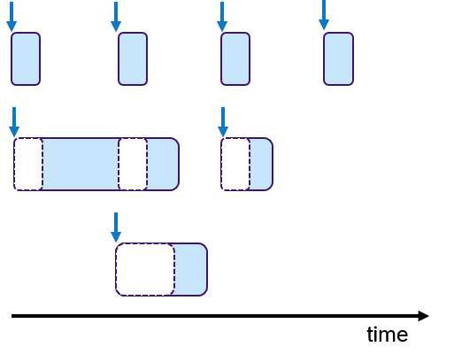
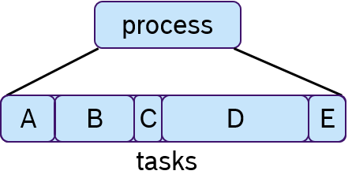
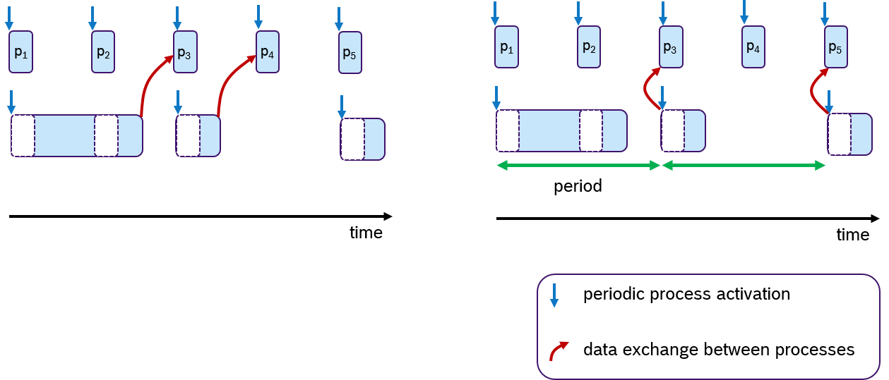
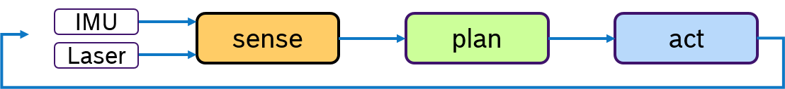
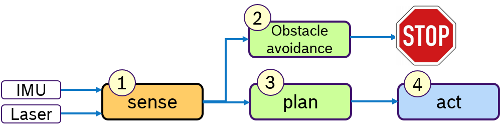

# The rclc package

## Table of Contents

[Overview](#overview)

[RCLC-Executor](#rclc-executor)
  * [Requirement Analysis](#requirement-analysis)
    * [Real-time embedded application use-case](#real-time-embedded-application-use-case)
    * [Sense-plan-act pipeline in mobile robotics](#sense-plan-act-pipeline-in-mobile-robotics)
    * [Synchronization of multiple rates](#synchronization-of-multiple-rates)
    * [High-priority processing path](#high-priority-processing-path)
  * [Features](#features)
    * [Sequential execution](#sequential-execution)
    * [Trigger condition](#trigger-condition)
    * [LET-Semantics](#let-semantics)
  * [Executor API](#executor-api)
    * [Configuration](#configuration-phase)
    * [Running](#running-phase)
    * [Clean-Up](#clean-up)
  * [Examples RCLC-Executor](#examples-rclc-executor)
    * [Example real-time embedded application use-case](#example-real-time-embedded-application-use-case)
    * [Example sense-plan-act pipeline in mobile robotics](#example-sense-plan-act-pipeline-in-mobile-robotics)
    * [Example synchronization of multiple rates](#example-synchronization-of-multiple-rates)
    * [Example high-priority processing path](#example-high-priority-processing-path)


[RCL Convenience Functions](#rcl-convenience-functions)

[RCLC-Example Package](#rclc-example-package)

[Limitations](#limitations)

[References](#references)

## Overview
The rclc-package is a [ROS 2](http://www.ros2.org/) package, which provides convenience functions to create ROS Client Library(RCL) data types and an RCLC-Executor in the C programming language.
The convenience functions are a thin API layer on top of RCL-layer to create publishers, subscribers, timers and nodes with a one-liner like in rclcpp.
The RCLC-Executor provides an API register subscriptions and timers as well as requesting data from DDS and executing the corresponding callbacks, like the rclcpp Executor for C++.
As described in [CB2019](#CB2019), it is difficult to reason about end-to-end latencies because of the complex semantics of the rclcpp Executor.
Therefore, the RCLC Executor comes with a number of features, which provides mechanisms for deterministic and real-time execution.

The quality declaration is available in [QUALITY_DECLARATION.md](QUALITY_DECLARATION.md).

## RCLC-Executor
Here we introduce the rclc Executor, which is a ROS 2 Executor implemented based on  and for the rcl API, for applications written in the C language.
Often embedded applications require real-time to guarantee end-to-end latencies and need deterministic runtime behavior to correctly replay test data.
However, this is difficult with the default ROS 2 Executor because of its complex semantics, as discussed in the previous section.

First, we will analyse the requirements for such applications and, secondly, derive simple features for an Executor to enable deterministic and real-time behavior.
Then we will present the API of the RCLC-Executor and provide example usages of the RCLC-Executor to address these requirements.

### Requirement Analysis
First we discuss a use-case in the embedded domain, in which the time-triggered paradigm is often used to guarantee deterministic and real-time behavior.
Then we analyse software design patterns in mobile robotics which enable deterministic behavior.

#### Real-time embedded application use-case
In embedded systems, real-time behavior is approached by using the time-triggered paradigm, which means that the processes are periodically activated.
Processes can be assigned priorities to allow pre-emptions.
Figure 1 shows an example, in which three processes with fixed periods are shown.
The middle and lower process are preempted multiple times depicted with empty dashed boxes.



Figure 1: Fixed periodic preemptive scheduling

To each process one or multiple tasks can be assigned, as shown in Figure 2.
These tasks are executed sequentially, which is often called cooperative scheduling.



Figure 2: Processes with sequentially executed tasks.

While there are different ways to assign priorities to a given number of processes, the rate-monotonic scheduling assignment, in which processes with a shorter period have a higher priority, has been shown optimal if the processor utilization is less than 69% [LL1973](#LL1973).

In the last decades many different scheduling approaches have been presented, however fixed-periodic preemptive scheduling is still widely used in embedded real-time systems [KZH2015](#KZH2015).
This becomes also obvious, when looking at the features of current operating systems.
Like Linux, real-time operating systems, such as NuttX, Zephyr, FreeRTOS, QNX etc., support fixed-periodic preemptive scheduling and the assignment of priorities, which makes the time-triggered paradigm the dominant design principle in this domain.

However, data consistency is often an issue when preemptive scheduling is used and if data is being shared across multiple processes via global variables.
Due to scheduling effects and varying execution times of processes, writing and reading these variables could occur sometimes sooner or later.
This results in an latency jitter of update times (the timepoint at which a variable change becomes visible to other processes).
Race conditions can occur when multiple processes access a variable at the same time. To solve this problem, the concept of logical-execution time (LET) was introduced in [HHK2001](#HHK2001), in which communication of data occurs only at pre-defined periodic time instances: Reading data only at the beginning of the period and writing data only at the end of the period.
The cost of an additional latency delay is traded for data consistency and reduced jitter.
This concept has also recently been applied to automotive applications  [NSP2018](#NSP2018).



Figure 3: Data communication without and with Logical Execution Time paradigm.

An Example of the LET concept is shown in Figure 3.
Assume that two processes are communicating data via one global variable.
The timepoint when this data is written is at the end of the processing time.
In the default case (left side), the process p<sub>3</sub> and p<sub>4</sub> receive the update.
At the right side of the figure, the same scenario is shown with LET semantics.
Here, the data is communicated only at period boundaries.
In this case, the lower process communicates at the end of the period, so that always process p<sub>3</sub> and p<sub>5</sub> receive the new data.

The described embedded use case relies on the following concepts:
- periodic execution of processes
- assignment of fixed priorities to processes
- preemptive scheduling of processes
- co-operative scheduling of tasks within a process (sequential execution)
- data synchronization with LET-semantics

While periodic activation is possible in ROS 2 by using timers, preemptive scheduling is supported by the operating system and assigning priorities on the granularity of threads/processes that correspond to the ROS nodes; it is not possible to sequentially execute callbacks, which have no data-dependency.
Furthermore data is read from the DDS queue just before the callback is executed and data is written sometime during the time the application is executed.
While the `spin_period` function of the rclcpp-Executor allows to check for data at a fixed period and executing those callbacks for which data is available, however, with this spin-function does not execute all callbacks irrespective wheter data is available or not.
So `spin_period` is not helpful to periodically execute a number of callbacks (aka tasks within a process).
So we need a mechanism that triggers the execution of multiple callbacks (aka tasks) based on a timer.
Data transmission is achieved via DDS which does not allow to implement a LET-semantics.
To summarize, we derive the following requirements:

Derived Requirements:
- trigger the execution of multiple callbacks
- sequential processing of callbacks
- data synchronization with LET semantics

#### Sense-plan-act pipeline in mobile robotics
In the next sections we describe common software design patterns which are used in mobile robotics to achieve deterministic behavior.
For each design pattern we describe the concept and the derived requirements for a deterministic Executor.
Concept:

A common design paradigm in mobile robotics is a control loop, consisting of several phases: A sensing phase to aquire sensor data, a plan phase for localization and path planning and an actuation-phase to steer the mobile robot.
Of course, more phases are possible, here these three phases shall serve as an example.
Such a processing pipeline is shown in Figure 4.



Figure 4: Multiple sensors driving a Sense-Plan-Act pipeline.

Typically multiple sensors are used to perceive the environment.
For example an IMU and a laser scanner.
The quality of localization algorithms highly depend on how old such sensor data is when it is processed.
Ideally the latest data of all sensors should be processed.
One way to achieve this is to execute first all sensor drivers in the sense-phase and then process all algorithms in the plan-phase.

Currently, such a processing order cannot be defined with the default ROS 2 Executor.
One could in principle design a data-driven pipeline, however if e.g. the Laser scan is needed by some other callback in the sense-phase as well as in the plan-phase, the processing order of these subscribers is arbitrary.

For this sense-plan-act pattern, we could define one executor for each phase.
The plan-phase would be triggered only when all callbacks in the sense-phase have finished.

Derived Requirements:
- triggered execution of callbacks

#### Synchronization of multiple rates

Concept:

Often multiple sensors are being used to sense the environment for mobile robotics.
While an IMU sensor provides data samples at a very high rate (e.g. 500 Hz), laser scans are available at a much slower frequency (e.g. 10Hz) determined by the revolution time.
Then the challenge is, how to deterministically fuse sensor data with different frequencies. This problem is depicted in Figure 5.


Figure 5: How to deterministically process multi-frequent sensor data.

Due to scheduling effects, the callback for evaluating the laser scan might be called just before or just after an IMU data is received.
One way to tackle this is to write additional synchronization code inside the application.
Obviously, this is a cumbersome and not-portable solution.

An Alternative would be to evaluate the IMU sample and the laser scan by synchronizing their frequency.
For example by processing always 50 IMU samples with one laser scan. This approach is shown in Figure 6.
A pre-processing callback aggregates the IMU samples and sends an aggregated message with 50 samples at 10Hz rate.
Now both messages have the same frequency.
With a trigger condition, which fires when both messages are available, the sensor fusion algorithm can expect always synchronized input data.


Figure 6: Synchronization of multiple input data with a trigger.

In ROS 2 this is currently not possible to be modeled because of the lack of a trigger concept in the ROS 2 Executor.
Message filters could be used to synchronize input data based on the timestamp in the header, but this is only available in rclcpp (and not in rcl).
Further more, it would be more efficient to have such a trigger concept directly in the Executor.
<!--
TODO
- Bilder erweitern mit drei boxen: request IMU, process laser, fusion
  dann wird klarer was mit den Daten wird
- Aus dem Bild die Beschreibung löschen
-->
Another idea would be to actively request for IMU data only when a laser scan is received.
This concept is shown in Figure 7.
Upon arrival of a laser scan message, first, a message with aggregated IMU samples is requested.
Then, the laser scan is processed and later the sensor fusion algorithm.
An Executor, which would support sequential execution of callbacks, could realize this idea.


Figure 7: Synchronization with sequential processing.

Derived Requirements from both concepts:
- triggered execution
- sequential processing of callbacks

#### High-priority processing path
Motivation:

Often a robot has to fullfill several activities at the same time. For example following a path and avoiding obstacles.
While path following is a permanent activity, obstacle avoidance is triggered by the environment and should be immediately reacted upon.
Therefore one would like to specify priorities to activities. This is depicted in Figure 8:



Figure 8: Managing high priority path with sequential order.

Assuming a simplified control loop with the activities sense-plan-act, the obstacle avoidance, which might temporarily stop the robot, should be processed before the planning phase.
In this example we assume that these activities are processed in one thread.

Derived requirements:
- sequential processing of callbacks

### Features

Based on the real-time embedded use-case as well as the software architecture patterns in mobile robotics, we propose an Executor with the following main features:
- user-defined sequential execution of callbacks
- trigger condition to activate processing
- data synchronization: LET-semantics or rclcpp Executor semantics

As stated before, this Executor is based on the RCL library and is written in C to natively support microcontroller applications written in C.
These features are now described in more detail.

#### Sequential execution

- At configuration, the user defines the order of handles.
- At configuration, the user defines, whether the handle shall be called only when new data is available (ON_NEW_DATA) or whether the callback shall always be called (ALWAYS).
- At runtime, all handles are processed in the user-defined order:
  - if the configuration of handle is ON_NEW_DATA, then the corresponding callback is only called if new data is available
  - if the configuration of the handle is ALWAYS, then the corresponding callback is always executed.
    In case, no data is available from DDS, then the callback is called with no data (e.g. NULL pointer).

#### Trigger condition

- Given a set of handles, a trigger condition based on the input data of these handles shall decide when the processing is started.

- Available options:
  - ALL operation: fires when input data is available for all handles
  - ANY operation: fires when input data is available for at least one handle
  - ONE: fires when input data for a user-specified handle is available
  - User-defined function: user can implement more sophisticated logic

#### LET-Semantics
- Assumption: time-triggered system, the executor is activated periodically
- When the trigger fires, reads all input data and makes a local copy
- Processes all callbacks in sequential order
- Write output data at the end of the executor's period (Note: this is not implemented yet)

Additionally we have implemented the current rclcpp Executor semantics RCLCPP:
- waiting for new data for all handles (rcl_wait)
- using trigger condition ANY
- if trigger fires, start processing handles in pre-defined sequential order
- request from DDS-queue the new data just before the handle is executed (rcl_take)

The selection of the LET semantics is optional. The default semantics is RCLCPP.
### Executor API

The API of the RCLC-Executor can be divided in several phases: Configuration, Running and Clean-Up.

#### Configuration phase

During the configuration phase, the user shall define:
- the total number of callbacks
- trigger condition (optional, default: ANY)
- data communcation semantics (optional, default RCLCPP)
- the processing sequence of the callbacks

The following functions are supported for this configuration:

**rclc_executor_t * rclc_get_zero_initialized_executor()**

Returns a zero initialized executor object.

**rclc_executor_init(rclc_executor_t * executor, rcl_context_t * context, const size_t number_of_handles, const rcl_allocator_t * allocator)**

As the Executor is intended for embedded controllers, dynamic memory management is crucial.
Therefore at initialization of the RCLC-Executor, the user defines the total number of handles `number_of_handles`.
The necessary dynamic memory will be allocated only in this phase and no more memory in the running phase.
This makes this Executor static in the sense, that during runtime no additional callbacks can be added.
The `context` is the RCL context, and `allocator` points to a memory allocator.

**rclc_executor_set_timeout(rclc_executor_t * executor, const uint64_t timeout_ns)**

The timeout in nano-seconds `timeout_ns`for waiting for new data from the DDS-queue is specified in `rclc_executor_set_timeout()` (this is the timeout parameter for `rcl_wait()`).

**rclc_executor_set_semantics(rclc_executor_t * executor, rclc_executor_semantics_t semantics)**

The data communication `semantics` can either be `RCLCPP`(default) or `LET`.

To be compatible with ROS 2 rclcpp Executor, the existing rclcpp semantics is implemented with the option `RCLCPP`.
That is, with the spin-function the DDS-queue is constantly monitored for new data (rcl_wait).
If new data becomes available, then it is fetched from DDS (rcl_take) immediately before the callback is executed.
All callbacks are processed in the user-defined order, this is the only difference to the rclcpp Executor, in which the order can not be defined by the user.

The `LET` semantics is implemented such that at the beginning of processing all available data is fetched (rcl_take) and buffered and then the callbacks are processed in the pre-defined operating on the buffered copy.

**rclc_executor_set_trigger(rclc_executor_t * executor, rclc_executor_trigger_t trigger_function, void * trigger_object)**

The trigger condition `rclc_executor_set_trigger` defines when the processing of the callbacks shall start.
For convenience some trigger conditions have been defined:
- `rclc_executor_trigger_any`(default) : start executing if any callback has new data
- `rclc_executor_trigger_all` : start executing if all callbacks have new data
- `rclc_executor_trigger_one(&data)` : start executing if `data` has been received
- `rclc_executor_trigger_always`: returns always true, that is every time the Executor spins, the processing of the callbacks is invocated.
For example with `spin_period` and this trigger condition as well as specifying all callbacks of subscriptions being called as `ALWAYS`, a fixed period execution of all callbacks can be implemented, irrespective whether new data is available or not.
- user_defined_function: the user can also define its own function with more complex logic

With `rclc_executor_trigger_any` being the default trigger condition, the current semantics of the rclcpp Executor is selected.

With the `rclc_executor_trigger_one` trigger, the handle to trigger is specified with `trigger_object`.
In the other cases of the trigger conditions this parameter shall be `NULL`.

**rclc_executor_add_subscription(rclc_executor_t * executor, rcl_subscription_t * subscription, void * msg, rclc_callback_t callback, rclc_executor_handle_invocation_t invocation)**

**rclc_executor_add_timer(  rclc_executor_t * executor, rcl_timer_t * timer)**

The user adds handles to the Executor the functions `rclc_executor_add_subscription()` for subscriptions and `rclc_executor_add_timer()` for timers.
The order in which these functions are called, defines later the sequential processing order during runtime.

For adding a subscription, the rcl subscription handle `subscription`, a pointer an allocated message `msg`, the message callback `callback` and an invocation option `invocation` need to be specified.
The invocation option specifies, whether the callback shall be executed only if new data is available (`ON_NEW_DATA`) or if the callback shall always be executed (`ALWAYS`).
The second option is useful for example when the callback is expected to be called at a fixed rate.

For a timer, only the rcl timer object `timer` is needed.

#### Running phase

**rclc_executor_spin_some(rclc_executor_t * executor, const uint64_t timeout_ns)**

The function `rclc_executor_spin_some` checks for new data from the DDS queue once.
It first copies all data into local data structures and then executes all handles according the specified order.
This implements the LET semantics.

**rclc_executor_spin(rclc_executor_t * executor)**

The function `rclc_executor_spin` calls `rclc_executor_spin_some` indefinitely as long
as the ROS system is alive.
This might create a high performance load on your processor.

**rclc_executor_spin_period(rclc_executor_t * executor, const uint64_t period)**

The function `rclc_executor_spin_period` calls `rclc_executor_spin_some` periodically
(as defined with the argument period) as long as the ROS system is alive.

**rclc_executor_spin_one_period(rclc_executor_t * executor, const uint64_t period)**

This is a function used by `rclc_executor_spin_period` to spin one time.
The purpose is to test the accurary of the spin_period function in the unit tests.

#### Clean-Up

**rclc_executor_fini()**

The function `rlce_executor_fini` frees the dynamically allocated memory of the executor.

### Examples RCLC Executor

We provide the relevant code snippets how to setup the RCLC-Executor for the embedded use case and for the software design patterns in mobile robotics applications as described above.

#### Example real-time embedded application use-case

With sequential execution the co-operative scheduling of tasks within a process can be modeled.
The trigger condition is used to periodically activate the process which will then execute all callbacks in a pre-defined order.
Data will be communicated using the LET-semantics.
Every Executor is executed in its own tread, to which an appropriate priority can be assigned.

In the following example, the Executor is setup with 4 handles.
We assume a process has three subscriptions `sub1`, `sub2`, `sub3`.
The sequential processing order is given by the order as they are added to the Executor.
A timer `timer` defines the period.
The `trigger_one` with the parameter `timer` is used, so that whenever the timer is ready, all callbacks are processed. Finally the data communication semantics LET is defined.
```C
#include "rcl_executor/let_executor.h"

// define subscription callback
void my_sub_cb1(const void * msgin)
{
  // ...
}
// define subscription callback
void my_sub_cb2(const void * msgin)
{
  // ...
}
// define subscription callback
void my_sub_cb3(const void * msgin)
{
  // ...
}

// define timer callback
void my_timer_cb(rcl_timer_t * timer, int64_t last_call_time)
{
  // ...
}

// necessary ROS 2 objects
rcl_context_t context;   
rcl_node_t node;
rcl_subscription_t sub1, sub2, sub3;
rcl_timer_t timer;
rcle_let_executor_t exe;

// define ROS context
context = rcl_get_zero_initialized_context();
// initialize ROS node
rcl_node_init(&node, &context,...);
// create subscriptions
rcl_subscription_init(&sub1, &node, ...);
rcl_subscription_init(&sub2, &node, ...);
rcl_subscription_init(&sub3, &node, ...);
// create a timer
rcl_timer_init(&timer, &my_timer_cb, ... );
// initialize executor with four handles
rclc_executor_init(&exe, &context, 4, ...);
// define static execution order of handles
rclc_executor_add_subscription(&exe, &sub1, &my_sub_cb1, ALWAYS);
rclc_executor_add_subscription(&exe, &sub2, &my_sub_cb2, ALWAYS);
rclc_executor_add_subscription(&exe, &sub3, &my_sub_cb3, ALWAYS);
rclc_executor_add_timer(&exe, &timer);
// trigger when handle 'timer' is ready
rclc_executor_set_trigger(&exe, rclc_executor_trigger_one, &timer);
// select LET-semantics
rclc_executor_data_comm_semantics(&exe, LET);
// spin forever
rclc_executor_spin(&exe);
```

#### Example sense-plan-act pipeline in mobile robotics

In this example we want to realise a sense-plan-act pipeline in a single thread. The trigger condition is demonstrated by activating the sense-phase when both data for the Laser and IMU are available.
Three executors are necessary `exe_sense`, `exe_plan` and `exe_act`. The two sensor acquisition callbacks `sense_Laser` and `sense_IMU` are registered in the Executor `exe_sense`.
The trigger condition ALL is responsible to activate the sense-phase only when all data for these two callbacks are available.
Finally all three Executors are spinning using a `while`-loop and the `spin_some` function.

The definitions of callbacks are omitted.

```C
...
rcl_subscription_t sense_Laser, sense_IMU, plan, act;
rcle_let_executor_t exe_sense, exe_plan, exe_act;
// initialize executors
rclc_executor_init(&exe_sense, &context, 2, ...);
rclc_executor_init(&exe_plan, &context, 1, ...);
rclc_executor_init(&exe_act, &context, 1, ...);
// executor for sense-phase
rclc_executor_add_subscription(&exe_sense, &sense_Laser, &my_sub_cb1, ON_NEW_DATA);
rclc_executor_add_subscription(&exe_sense, &sense_IMU, &my_sub_cb2, ON_NEW_DATA);
rclc_let_executor_set_trigger(&exe_sense, rclc_executor_trigger_all, NULL);
// executor for plan-phase
rclc_executor_add_subscription(&exe_plan, &plan, &my_sub_cb3, ON_NEW_DATA);
// executor for act-phase
rclc_executor_add_subscription(&exe_act, &act, &my_sub_cb4, ON_NEW_DATA);

// spin all executors
while (true) {
  rclc_executor_spin_some(&exe_sense);
  rclc_executor_spin_some(&exe_plan);
  rclc_executor_spin_some(&exe_act);
}
```
#### Example synchronization of multiple rates

The sensor fusion synchronizing the multiple rates with a trigger is shown below.

```C
...
rcl_subscription_t aggr_IMU, sense_Laser, sense_IMU;
rcle_let_executor_t exe_aggr, exe_sense;
// initialize executors
rclc_executor_init(&exe_aggr, &context, 1, ...);
rclc_executor_init(&exe_sense, &context, 2, ...);
// executor for aggregate IMU data
rclc_executor_add_subscription(&exe_aggr, &aggr_IMU, &my_sub_cb1, ON_NEW_DATA);
// executor for sense-phase
rclc_executor_add_subscription(&exe_sense, &sense_Laser, &my_sub_cb2, ON_NEW_DATA);
rclc_executor_add_subscription(&exe_sense, &sense_IMU, &my_sub_cb3, ON_NEW_DATA);
rclc_executor_set_trigger(&exe_sense, rclc_executor_trigger_all, NULL);

// spin all executors
while (true) {
  rclc_executor_spin_some(&exe_aggr);
  rclc_executor_spin_some(&exe_sense);
}
```

The setup for the sensor fusion using sequential execution is shown below.
Note, that the sequential order is `sense_IMU`, which will request the aggregated IMU message, and then `sense_Laser` while the trigger will fire, when a laser message is received.

```C
...
rcl_subscription_t sense_Laser, sense_IMU;
rcle_let_executor_t exe_sense;
// initialize executor
rclc_executor_init(&exe_sense, &context, 2, ...);
// executor for sense-phase
rclc_executor_add_subscription(&exe_sense, &sense_IMU, &my_sub_cb1, ALWAYS);
rclc_executor_add_subscription(&exe_sense, &sense_Laser, &my_sub_cb2, ON_NEW_DATA);
rclc_executor_set_trigger(&exe_sense, rclc_executor_trigger_one, &sense_Laser);
// spin
rclc_executor_spin(&exe_sense);
```
#### Example high-priority processing path

This example shows the sequential processing order to execute the obstacle avoidance `obst_avoid`
after the callbacks of the sense-phase and before the callback of the planning phase `plan`.
The control loop is started when a laser message is received.
Then an aggregated IMU message is requested, like in the example above.
Then all the other callbacks are always executed. This assumes that these callbacks communicate via a global data structure.
Race conditions cannot occur, because the callbacks run all in one thread.

```C
...
rcl_subscription_t sense_Laser, sense_IMU, plan, act, obst_avoid;
rcle_let_executor_t exe;
// initialize executors
rclc_executor_init(&exe, &context, 5, ...);
// define processing order
rclc_executor_add_subscription(&exe, &sense_IMU, &my_sub_cb1, ALWAYS);
rclc_executor_add_subscription(&exe, &sense_Laser, &my_sub_cb2, ON_NEW_DATA);
rclc_executor_add_subscription(&exe, &obst_avoid, &my_sub_cb3, ALWAYS);
rclc_executor_add_subscription(&exe, &plan, &my_sub_cb4, ALWAYS);
rclc_executor_add_subscription(&exe, &act, &my_sub_cb5, ALWAYS);
rclc_executor_set_trigger(&exe, rclc_executor_trigger_one, &sense_Laser);
// spin
rclc_executor_spin(&exe);
```

## RCL convenience functions

The rclc package also provides a number of convenience functions, which make it easier to
 create the RCL-objects `rcl_node_t`, `rcl_subscription_t`, `rcl_timer_t` and `rcl_publisher_t`.

Convenience functions:
- rclc_support_init()
- rclc_support_init_with_options()
- rclc_support_fini()
- rclc_node_init_default()
- rclc_publisher_init_default()
- rclc_subscription_init_default()
- rclc_timer_init_default()

The setup of RCL objects is simplified, by defining a new type `rclc_support_t`, which contains
the parameters used in multiple RCL initialization functions:

```C
typedef struct
{
  rcl_init_options_t init_options;
  rcl_context_t context;
  rcl_allocator_t * allocator;
  rcl_clock_t clock;
} rclc_support_t;
```

In the example provided in [rclc_examples](../rclc_examples), one node with one publisher, one timer and one subscription is implemented with and without the convenience functions.
The number of code lines of the example to setup the rcl objects with the convenience functions is reduced by 24% compared to the initialization using the rcl API.

## RCLC-Example Package

An example, how to use the RCLC-Executor with RCL objects is given in the file `example_executor.c` in the package: [rclc_examples](../rclc_examples).

An example, how to use the RCLC-Executor with the rclc convenience functions is given in the file
 `example_executor_convenience.c` the package: [rclc_examples](../rclc_examples).

## Limitations:

- support for subscriptions and timers (services, clients, guard conditions are not supported yet)
- LET semantics: writing at the end of period not implemented


## References

* [CB2019]<a name="CB2019"> </a> D. Casini, T. Blaß, I. Lütkebohle, B. Brandenburg: Response-Time Analysis of ROS 2 Processing Chains under Reservation-Based Scheduling, in Euromicro-Conference on Real-Time Systems 2019. [[Paper](http://drops.dagstuhl.de/opus/volltexte/2019/10743/)].[[slides]](https://t-blass.de/talks/ECRTS2019.pdf)

* [EK2018]<a name="EK2018"></a> R. Ernst, S. Kuntz, S. Quinton, M. Simons: The Logical Execution Time Paradigm: New Perspectives for Multicore Systems, February 25-28 2018 (Dagstuhl Seminar 18092). [[Paper]](http://drops.dagstuhl.de/opus/volltexte/2018/9293/pdf/dagrep_v008_i002_p122_18092.pdf)

* [BP2017]<a name="BP2017"></a> A. Biondi, P. Pazzaglia, A. Balsini,  M. D. Natale: Logical Execution Time Implementation and Memory Optimization Issues in AUTOSAR Applications for Multicores, International Worshop on Analysis Tools and Methodologies for Embedded and Real-Time Systems (WATERS2017), Dubrovnik, Croatia.[[Paper]](https://pdfs.semanticscholar.org/4a9e/b9a616c25fd0b4a4f7810924e73eee0e7515.pdf)

* [LL1973]<a name="LL1973"></a> Liu, C. L.; Layland, J.:Scheduling algorithms for multiprogramming in a hard real-time environment, Journal of the ACM, 20 (1): 46–61, 1973.

* [HHK2001]<a name="HHK2001"></a> Henzinger T.A., Horowitz B., Kirsch C.M. (2001) Giotto: A Time-Triggered Language for Embedded Programming. In: Henzinger T.A., Kirsch C.M. (eds) Embedded Software. EMSOFT 2001. Lecture Notes in Computer Science, vol 2211. Springer, Berlin, Heidelberg

* [NSP2018]<a name="NSP2018"></a> A. Naderlinger, S. Resmerita, and W. Pree: LET for Legacy and Model-based Applications,
Proceedings of The Logical Execution Time Paradigm: New Perspectives for Multicore Systems (Dagstuhl Seminar 18092), Wadern, Germany, February 2018.

* [KZH2015]<a name="KZH2015"></a> S. Kramer, D. Ziegenbein, and A. Hamann: Real World Automotive Benchmarks For Free, International Workshop on Analysis Tools and Methodologies for Embedded adn Real-Time Sysems (WATERS), 2015.[[Paper]](https://www.ecrts.org/forum/download/file.php?id=9&sid=efda71c95b6afdd240d72cc1e491bb8b)
* [micro-ROS] [micro-ROS project](https://micro-ros.github.io/)

<!--
## Guide to setup the RCLC-Executor with RCL API

You find the complete source code in the package `rclc_examples`, file example_executor.c.

**Step 1:** <a name="Step1"> </a> Include the `executor.h` from the rclc package and other headers in your C code.
As well as some global data structured used by the publisher and subscriber.

```C
#include <stdio.h>
#include <std_msgs/msg/string.h>
#include "rclc/executor.h"
// these data structures for the publisher and subscriber are global, so that
// they can be configured in main() and can be used in the corresponding callback.
rcl_publisher_t my_pub;
std_msgs__msg__String pub_msg;
std_msgs__msg__String sub_msg;
```

**Step 2:** <a name="Step2"> </a> Define a subscription callback `my_subscriber_callback`.

```C
void my_subscriber_callback(const void * msgin)
{
  const std_msgs__msg__String * msg = (const std_msgs__msg__String *)msgin;
  if (msg == NULL) {
    printf("Callback: msg NULL\n");
  } else {
    printf("Callback: I heard: %s\n", msg->data.data);
  }
}
```

**Step 3:** <a name="Step3"> </a> Define a timer callback `my_timer_callback`.

```C
#define RCLC_UNUSED(x) (void)x
void my_timer_callback(rcl_timer_t * timer, int64_t last_call_time)
{
  rcl_ret_t rc;
  RCLC_UNUSED(last_call_time);
  if (timer != NULL) {
    //printf("Timer: time since last call %d\n", (int) last_call_time);
    rc = rcl_publish(&my_pub, &pub_msg, NULL);
    if (rc == RCL_RET_OK) {
      printf("Published message %s\n", pub_msg.data.data);
    } else {
      printf("timer_callback: Error publishing message %s\n", pub_msg.data.data);
    }
  } else {
    printf("timer_callback Error: timer parameter is NULL\n");
  }
}
```

**Step 4:** <a name="Step4"> </a> Create a rcl_node in main function.

```C
int main(int argc, const char * argv[])
{
  rcl_context_t context = rcl_get_zero_initialized_context();
  rcl_init_options_t init_options = rcl_get_zero_initialized_init_options();
  rcl_allocator_t allocator = rcl_get_default_allocator();
  rcl_ret_t rc;

  // create init_options
  rc = rcl_init_options_init(&init_options, allocator);
  if (rc != RCL_RET_OK) {
    printf("Error rcl_init_options_init.\n");
    return -1;
  }

  // create context
  rc = rcl_init(argc, argv, &init_options, &context);
  if (rc != RCL_RET_OK) {
    printf("Error in rcl_init.\n");
    return -1;
  }

  // create rcl_node
  rcl_node_t my_node = rcl_get_zero_initialized_node();
  rcl_node_options_t node_ops = rcl_node_get_default_options();
  rc = rcl_node_init(&my_node, "node_0", "executor_examples", &context, &node_ops);
  if (rc != RCL_RET_OK) {
    printf("Error in rcl_node_init\n");
    return -1;
  }
```
**Step 5:** <a name="Step5"> </a> Create an rcl_publisher `my_pub` which publishes messages using the rcl_timer `my_timer`.
```C
  // create a publisher to publish topic 'topic_0' with type std_msg::msg::String
  // my_pub is global, so the timer_callback access this publisher.
  const char * topic_name = "topic_0";
  rcl_publisher_options_t pub_options = rcl_publisher_get_default_options();
  rc = rcl_publisher_init(
    &my_pub,
    &my_node,
    ROSIDL_GET_MSG_TYPE_SUPPORT(std_msgs, msg, String),
    topic_name,
    &pub_options);
  if (RCL_RET_OK != rc) {
    printf("Error in rcl_publisher_init %s.\n", topic_name);
    return -1;
  }


  // create a timer, which will call the publisher every 'timer_timeout' ms in the 'my_timer_callback'
  rcl_clock_t clock;
  rc = rcl_clock_init(RCL_STEADY_TIME, &clock, &allocator);
  if (rc != RCL_RET_OK) {
    printf("Error in rcl_clock_init.\n");
    return -1;
  }
  rcl_timer_t my_timer = rcl_get_zero_initialized_timer();
  const unsigned int timer_timeout = 1000;
  rc = rcl_timer_init(
    &my_timer,
    &clock,
    &context,
    RCL_MS_TO_NS(timer_timeout),
    my_timer_callback,
    allocator);
  if (rc != RCL_RET_OK) {
    printf("Error in rcl_timer_init.\n");
    return -1;
  } else {
    printf("Created timer with timeout %d ms.\n", timer_timeout);
  }

  // assign message to publisher
  std_msgs__msg__String__init(&pub_msg);
  const unsigned int PUB_MSG_SIZE = 20;
  char pub_string[PUB_MSG_SIZE];
  snprintf(pub_string, 13, "%s", "Hello World!");
  rosidl_generator_c__String__assignn(&pub_msg.data, pub_string, PUB_MSG_SIZE);
```
**Step 6:** <a name="Step6"> </a> Create an rcl_subscription `my_sub` with the topic `topic_name`.

```C
  // create subscription
  rcl_subscription_t my_sub = rcl_get_zero_initialized_subscription();
  rcl_subscription_options_t my_subscription_options = rcl_subscription_get_default_options();
  const rosidl_message_type_support_t * my_type_support =
    ROSIDL_GET_MSG_TYPE_SUPPORT(std_msgs, msg, String);

  rc = rcl_subscription_init(
    &my_sub,
    &my_node,
    my_type_support,
    topic_name,
    &my_subscription_options);

  if (rc != RCL_RET_OK) {
    printf("Failed to create subscriber %s.\n", topic_name);
    return -1;
  } else {
    printf("Created subscriber %s:\n", topic_name);
  }

  // one string message for subscriber
  std_msgs__msg__String__init(&sub_msg);
```

**Step 7:** <a name="Step7"> </a> Create an RCLC-Executor and initialize it with the ROS context
(`context`), number of handles (`2`) and use the `allocator` for memory allocation.

The user can configure, when the callback shall be invoked: Options are `ALWAYS` and `ON_NEW_DATA`. If `ALWAYS` is selected, the callback is always called, even if no new data is available. In this case, the callback is given a `NULL`pointer for the argument `msgin` and the callback needs to handle this correctly. If `ON_NEW_DATA` is selected, then the callback is called only if new data from the DDS queue is available. In this case the parameter `msgin` of the callback always points to memory-allocated message.

```C
  rclc_executor_t executor;
  // compute total number of subsribers and timers
  unsigned int num_handles = 1 + 1;
  executor = rclc_executor_get_zero_initialized_executor();
  rclc_executor_init(&executor, &context, num_handles, &allocator);
```
**Step 8:** <a name="Step8"> </a>(Optionally) Define the blocking time when requesting new data from DDS (timeout for rcl_wait()). Here the timeout is `1000ms`.
The default timeout is 100ms.

```C
  // set timeout for rcl_wait()
  unsigned int rcl_wait_timeout = 1000;   // in ms
  rc = rclc_executor_set_timeout(&executor, RCL_MS_TO_NS(rcl_wait_timeout));
  if (rc != RCL_RET_OK) {
    printf("Error in rclc_executor_set_timeout.");
  }
```

**Step 9:** <a name="Step9"> </a> Add the subscription `my_sub` (See [Step 6](#Step6)) to the `executor` with the message variable `my_msg`, in which the new data is stored and the callback function `my_subscriber_callback`(See [Step 2](#Step2)). The callback is invoked if new data is available (`ON_NEW_DATA`).

```C
  // add subscription to executor
  rc = rclc_executor_add_subscription(&executor, &my_sub, &sub_msg, &my_subscriber_callback,
      ON_NEW_DATA);
  if (rc != RCL_RET_OK) {
    printf("Error in rclc_executor_add_subscription. \n");
  }
```

**Step 10:** <a name="Step10"> </a> Add timer `my_timer`, as defined in [Step 5](#Step5) to the `executor`. The period of the timer and the callback to call are already configured in the timer object itself.

```C
  rclc_executor_add_timer(&executor, &my_timer);
  if (rc != RCL_RET_OK) {
    printf("Error in rclc_executor_add_timer.\n");
  }
```

**Step 11:** <a name="Step11"> </a> Run the executor. As an example, we demonstrate also spin ten times with a rcl_wait-timeout of 1s.

```C
  for (unsigned int i = 0; i < 10; i++) {
    // timeout specified in ns (here 1s)
    rclc_executor_spin_some(&executor, 1000 * (1000 * 1000));
  }
```

**Step 12:** <a name="Step12"> </a> Clean up memory for the RCLC-Executor and other other RCL objects

```C
  rc = rclc_executor_fini(&executor);
  rc += rcl_publisher_fini(&my_pub, &my_node);
  rc += rcl_timer_fini(&my_timer);
  rc += rcl_subscription_fini(&my_sub, &my_node);
  rc += rcl_node_fini(&my_node);
  rc += rcl_init_options_fini(&init_options);
  if (rc != RCL_RET_OK) {
    printf("Error while cleaning up!\n");
    return -1;
  }
  return 0;
}  // main
```

**Output** If you run the example executor, you should see the following output:
```C
Created timer with timeout 1000 ms.
Created subscriber topic_0:
Debug: number of DDS handles: 2
Published message Hello World!
Callback: I heard: Hello World!
Published message Hello World!
Callback: I heard: Hello World!
Published message Hello World!
Callback: I heard: Hello World!
Published message Hello World!
Callback: I heard: Hello World!
Published message Hello World!
Callback: I heard: Hello World!
```

## Example RCLC-Executor with convenience functions

An example, how to use the LET Executor with rclc convenience functions is given in the file
`example_executor_convenience.c` in the package:
[rclc_examples](../rclc_examples).
-->
