# The rclc package

## Table of contents

*   [Introduction](#introduction)

*   [Analysis of rclcpp standard Executor](#analysis-of-rclcpp-standard-executor)
    * [Architecture](#architecture)
    * [Scheduling Semantics](#scheduling-semantics)

*   [Analysis of processing patterns](#analysis-of-processing-patterns)
    * [Sense-plan-act pipeline in robotics](#sense-plan-act-pipeline-in-robotics)
    * [Synchronization of multiple rates](#synchronization-of-multiple-rates)
    * [High-priority processing path](#high-priority-processing-path)
    * [Real-time embedded applications](#real-time-embedded-applications)
*   [rclc Executor](#rclc-executor)
    * [Features](#features)
      * [Trigger condition](#trigger-condition)
      * [Sequential execution](#sequential-execution)
      * [LET-Semantics](#let-semantics)
      * [Multi-threading and scheduling configuration](#multi-threading-and-scheduling-configuration)
    * [Executor API](#executor-api)
      * [Configuration phase](#configuration-phase)
      * [Running phase](#running-phase)
    * [Examples](#examples)
      * [Sense-plan-act pipeline in robotics example](#sense-plan-act-pipeline-in-robotics-example)
      * [Synchronization of multiple rates example](#synchronization-of-multiple-rates-example)
      * [High-priority processing path example](#high-priority-processing-path-example)
      * [Real-time embedded applications example](#real-time-embedded-applications-example)
      * [ROS 2 Executor Workshop Reference System](#ros-2-executor-workshop-reference-system)
    * [Future work](#future-work)
    * [Download](#download)

*   [Callback-group-level Executor](#callback-group-level-executor)
    *   [API Changes](#api-changes)
    *   [Test Bench](#test-bench)

*   [Related Work](#related-work)
    * [Fawkes Framework](#fawkes-framework)
*   [References](#references)


## Introduction

Predictable execution under given real-time constraints is a crucial requirement for many robotic applications. While the service-based paradigm of ROS allows a fast integration of many different functionalities, it does not provide sufficient control over the execution management. For example, there are no mechanisms to enforce a certain execution order of callbacks within a node. Also the execution order of multiple nodes is essential for control applications in mobile robotics. Cause-effect-chains comprising of sensor acquisition, evaluation of data and actuation control should be mapped to ROS nodes executed in this order, however there are no explicit mechanisms to enforce it. Furthermore, when data recordings collected in field tests as ROS-bags are re-played, then the results are often surprisingly different due to non-determinism of process scheduling.

Manually setting up a particular execution order of subscriptions and publishing topics as well as defining use-case specific priorities of the corresponding Linux processes is always possible. However, this approach is error-prone, difficult to extend and requires an in-depth knowledge of the deployed ROS 2 packages in the system.

Therefore the goal of the Executor in micro-ROS is to support roboticists with practical and easy-to-use real-time mechanisms which provide solutions for:
- Deterministic execution
- Real-time guarantees
- Integration of real-time and non real-time functionalities on one platform
- Specific support for RTOS and microcontrollers


In ROS 1 a network thread is responsible for receiving all messages and putting them into a FIFO queue (in roscpp). That is, all callbacks were called in a FIFO manner, without any execution management. With the introduction of DDS (data distribution service) in ROS 2, the messages are buffered in DDS. In ROS 2, an Executor concept was introduced to support execution management. At the rcl-layer, a _wait-set_ is configured with handles to be received and in a second step, the handles are taken from the DDS-queue. A handle is a generic term defined in rcl-layer for timers, subscriptions, services, clients and guard conditions.

The standard implementation of the ROS 2 Executor for the C++ API (rclcpp) has, however, certain unusual features, like precedence of timers over all other DDS handles, non-preemptive round-robin scheduling for non-timer handles and considering only one input data for each handle (even if multiple could be available). These features have the consequence, that in certain situations the standard rclcpp Executor is not deterministic and it makes guaranteeing real-time requirements very hard [[CB2019](#CB2019)]. We have not looked at the ROS 2 Executor implementation for Python Frontend (rclpy) because we consider a micro-controllers platform, on which typically C or C++ appliations will run.

Given the goals for a Real-Time Executor and the limitations of the ROS 2 standard rclcpp Executor, the challenges are:
- to develop an adequate and well-defined scheduling mechanisms for the ROS 2 framework and the real-time operating system (RTOS)
- to define an easy-to-use interface for ROS developers
- to model requirements (like latencies, determinism in subsystems)
- mapping of ROS 2 framework and operating system schedulers (semi-automated and optimized mapping is desired as well as generic, well-understood framework mechanisms)

Our approach is to provide a real-time-capable Executor for the rcl+rclc layer (as described in section [Introduction to Client Library](../).) in the C programming language .

As the first step, we propose the rclc Executor for the rcl-layer in C programming language with several new features to support real-time and deterministic execution: It supports 1.) user-defined static sequential execution, 2) conditional execution semantics, 3) multi-threaded execution with scheduling configuration, and 4) logical execution semantics (LET). Sequential execution refers to the runtime behavior, that all callbacks are executed in a pre-defined order independent of the arrival time of messages. Conditional execution is available with a trigger condition which enables typical processing patterns in robotics (which are analyzed in detail in section [Analysis of processing patterns](#analysis-of-processing-patterns). Configuration of scheduling parameters for multi-threaded application accomplishes prioritized execution. The logical execution time concept (LET) provides data synchronization for fixed periodic task scheduling of embedded applications. 

Beyond the advanced execution management mechanisms for micro-ROS, we also contributed to improving and extending the Executor concept in rclcpp for standard ROS 2: the callback group-level Executor. It is not a new Executor but rather a refinement of the ROS 2 Executor API allowing to prioritize a group of callbacks which is not possible with the ROS 2 default Executor in its current Galactic release.


## Analysis of rclcpp standard Executor

ROS 2 allows to bundle multiple nodes in one operating system process. To coordinate the execution of the callbacks of the nodes of a process, the Executor concept was introduced in rclcpp (and also in rclpy).

The ROS 2 design defines one Executor (instance of [rclcpp::executor::Executor](https://github.com/ros2/rclcpp/blob/master/rclcpp/include/rclcpp/executor.hpp)) per process, which is typically created either in a custom main function or by the launch system. The Executor coordinates the execution of all callbacks issued by these nodes by checking for available work (timers, services, messages, subscriptions, etc.) from the DDS queue and dispatching it to one or more threads, implemented in [SingleThreadedExecutor](https://github.com/ros2/rclcpp/blob/master/rclcpp/include/rclcpp/executors/single_threaded_executor.hpp) and [MultiThreadedExecutor](https://github.com/ros2/rclcpp/blob/master/rclcpp/include/rclcpp/executors/multi_threaded_executor.hpp), respectively.

The dispatching mechanism resembles the ROS 1 spin thread behavior: the Executor looks up the wait sets, which notifies it of any pending callback in the DDS queue. If there are multiple pending callbacks, the ROS 2 Executor executes them in an in the order as they were registered at the Executor.

### Architecture

The following diagram depicts the relevant classes of the standard ROS 2 Executor implementation:

<center>
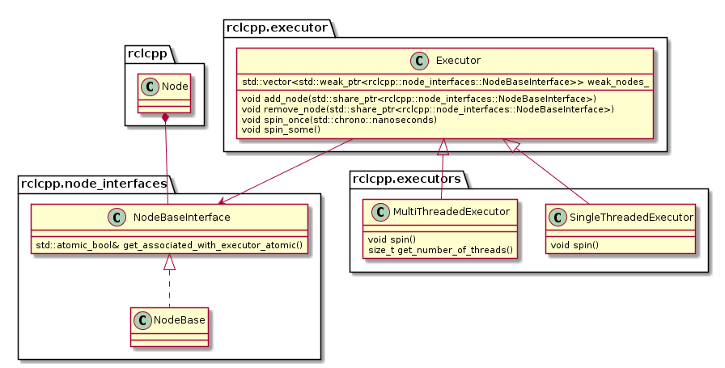
</center>

Note that an Executor instance maintains weak pointers to the NodeBaseInterfaces of the nodes only. Therefore, nodes can be destroyed safely, without notifying the Executor.

Also, the Executor does not maintain an explicit callback queue, but relies on the queue mechanism of the underlying DDS implementation as illustrated in the following sequence diagram:

<center>
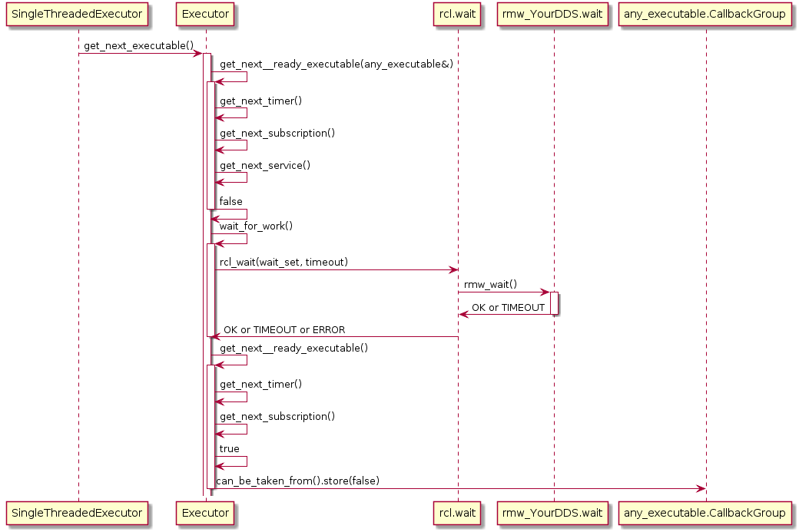
</center>

The Executor concept, however, does not provide means for prioritization or categorization of the incoming callback calls. Moreover, it does not leverage the real-time characteristics of the underlying operating-system scheduler to have finer control on the order of executions. The overall implication of this behavior is that time-critical callbacks could suffer possible deadline misses and a degraded performance since they are serviced later than non-critical callbacks. Additionally, due to the FIFO mechanism, it is difficult to determine usable bounds on the worst-case latency that each callback execution may incur.

### Scheduling Semantics

In a recent paper [[CB2019](#CB2019)], the rclcpp Executor has been analyzed in detail and a response time analysis of cause-effect chains has been proposed under reservation-based scheduling. The Executor distinguishes four categories of callbacks: _timers_, which are triggered by system-level timers, _subscribers_, which are triggered by new messages on a subscribed topic, _services_, which are triggered by service requests, and _clients_, which are triggered by responses to service requests. The Executor is responsible for taking messages from the input queues of the DDS layer and executing the corresponding callback. Since it executes callbacks to completion, it is a non-preemptive scheduler, However it does not consider all ready tasks for execution, but only a snapshot, called readySet. This readySet is updated when the Executor is idle and in this step it interacts with the DDS layer updating the set of ready tasks. Then for every type of task, there are dedicated queues (timers, subscriptions, services, clients) which are processed sequentially. The following undesired properties were pointed out:

* Timers have the highest priority. The Executor processes _timers_ always first.  This can lead to the intrinsic effect, that in overload situations messages from the DDS queue are not processed.
* Non-preemptive round-robin scheduling of non-timer handles. Messages arriving during the processing of the readySet are not considered until the next update, which depends on the execution time of all remaining callbacks. This leads to priority inversion, as lower-priority callbacks may implicitly block higher-priority callbacks by prolonging the current processing of the readySet.
* Only one message per handle is considered. The readySet contains only one task instance, For example, even if multiple messages of the same topic are available, only one instance is processed until the Executor is idle again and the readySet is updated from the DDS layer. This aggravates priority inversion, as a backlogged callback might have to wait for multiple processing of readySets until it is considered for scheduling. This means that non-timer callback instances might be blocked by multiple instances of the same lower-priority callback.

Due to these findings, the authors present an alternative approach to provide determinism and to apply well-known schedulability analyses to a ROS 2 systems. A response time analysis is described under reservation-based scheduling.

## Analysis of processing patterns
The development of an execution management mechanism for micro-ROS is based on an analysis of processing patterns commonly used in robotics and embedded systems. First, typical processing patterns in mobile robotics are presented which are used to implement deterministic behavior. Then, the processing patterns in the real-time embedded systems are analyzed, in which, as a main difference, the time-triggered paradigm is applied to accomplish real-time behavior. 

### Sense-plan-act pipeline in robotics
Now we describe common software design patterns which are used in mobile robotics to achieve deterministic behavior. For each design pattern we describe the concept and the derived requirements for a deterministic Executor.

**Concept:**

A common design paradigm in mobile robotics is a control loop, consisting of several phases: A sensing phase to aquire sensor data, a plan phase for localization and path planning and an actuation-phase to steer the mobile robot. Of course, more phases are possible, here these three phases shall serve as an example. Such a processing pipeline is shown in Figure 1.

<center>
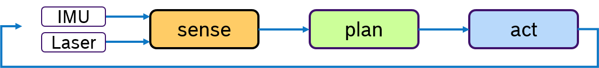
</center>
<center>
Figure 1: Multiple sensors driving a Sense-Plan-Act pipeline.
</center>

Typically multiple sensors are used to perceive the environment. For example an IMU and a laser scanner. The quality of localization algorithms highly depend on how old such sensor data is when it is processed. Ideally the latest data of all sensors should be processed. One way to achive this is to execute first all sensor drivers in the sense-phase and then process all algorithms in the plan-phase.

Currently, such a processing order cannot be defined with the default Executor of rclcpp. One could in principle design a data-driven pipeline, however if e.g. the Laser scan is needed by some other callback in the sense-phase as well as in the plan-phase, the processing order of these subscribers is arbitrary.

For this sense-plan-act pattern, we could define one executor for each phase. The plan-phase would be triggered only when all callbacks in the sense-phase have finished.

**Derived requirements:**
- triggered execution

### Synchronization of multiple rates

**Concept:**

Often multiple sensors are being used to sense the environment for mobile robotics. While an IMU sensor provides data samples at a very high rate (e.g., 500 Hz), laser scans are availabe at a much slower frequency (e.g. 10Hz) determined by the revolution time. Then the challenge is, how to deterministically fuse sensor data with different frequencies. This problem is depicted in Figure 2.

<center>
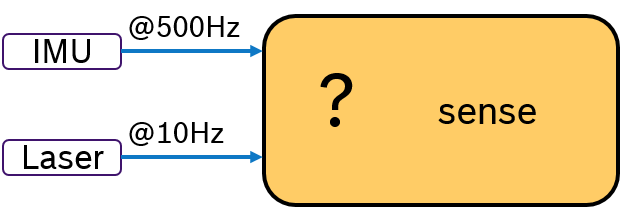
</center>
<center>
Figure 2: How to deterministically process multi-frequent sensor data.
</center>

Due to scheduling effects, the callback for evaluating the laser scan might be called just before or just after an IMU data is received. One way to tackle this is to write additional synchronization code inside the application. Obviously, this is a cumbersome and not-portable solution.

An Alternative would be to evalute the IMU sample and the laser scan by synchronizing their frequency. For example by processing always 50 IMU samples with one laser scan. This approach is shown in Figure 3. A pre-processing callback aggregates the IMU samples and sends an aggregated message with 50 samples at 10Hz rate. Now both messages have the same frequency. With a trigger condition, which fires when both messages are available, the sensor fusion algorithm can expect always synchronized input data.

<center>
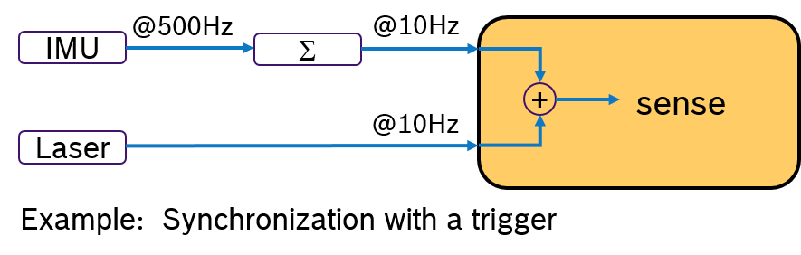
</center>
<center>
Figure 3: Synchronization of multiple input data with a trigger.
</center>

In ROS 2, this is currently not possible to be modeled because of the lack of a trigger concept in the Executors of rclcpp and rclpy. Message filters could be used to synchronize input data based on the timestamp in the header, but this is only available in rclcpp (and not in rcl). Further more, it would be more efficient to have such a trigger concept directly in the Executor.

Another idea would be to activly request for IMU data only when a laser scan is received. This concept is shown in Figure 4. Upon arrival of a laser scan mesage, first, a message with aggregated IMU samples is requested. Then, the laser scan is processed and later the sensor fusion algorithm. An Executor, which would support sequential execution of callbacks, could realize this idea.

<center>
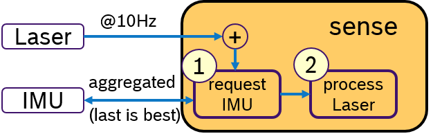
</center>
<center>
Figure 4: Synchronization with sequential processing.
</center>

**Derived requirements:**
- triggered execution
- sequential procesing of callbacks

### High-priority processing path
**Concept**
Often a robot has to fullfill several activities at the same time. For example following a path and avoiding obstacles. While path following is a permanent activity, obstacle avoidance is trigged by the environment and should be immediately reacted upon. Therefore one would like to specify priorities to activities. This is depicted in Figure 5:

<center>

</center>
<center>
Figure 5: Managing high priority path with sequential order.
</center>

Assuming a simplified control loop with the activities sense-plan-act, the obstacle avoidance, which might temporarily stop the robot, should be processed before the planning phase. In this example we assume that these activites are processed in one thread.

**Derived requirements:**
- sequential processing of callbacks


### Real-time embedded applications
In embedded systems, real-time behavior is approached by using the time-triggered paradigm, which means that the processes are periodically activated. Processes can be assigned priorities to allow pre-emptions. Figure 6 shows an example, in which three processes with fixed periods are shown. The middle and lower process are preempted multiple times depicted with empty dashed boxes.

<center>

</center>
<center>
Figure 6: Fixed periodic preemptive scheduling.
</center>

To each process one or multiple tasks can be assigned, as shown in Figure 7. These tasks are executed sequentially, which is often called cooperative scheduling.

<center>
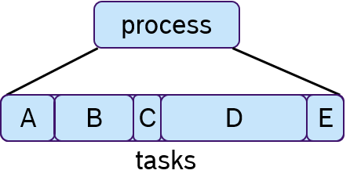
</center>
<center>
Figure 7: Processes with sequentially executed tasks.
</center>

While there are different ways to assign priorities to a given number of processes,
the rate-monotonic scheduling assignment, in which processes with a shorter period have a higher priority, has been shown optimal if the processor utilization is less than 69% [[LL1973](#LL1973)].

 In the last decades many different scheduling approaches have been presented, however fixed-periodic preemptive scheduling is still widely used in embedded real-time systems [[KZH2015](#KZH2015)]. This becomes also obvious, when looking at the features of current operating systems. Like Linux, real-time operating systems, such as NuttX, Zephyr, FreeRTOS, QNX etc., support fixed-periodic preemptive scheduling and the assignment of priorities, which makes the time-triggered paradigm the dominant design principle in this domain.

However, data consistency is often an issue when preemptive scheduling is used and if data is being shared across multiple processes via global variables. Due to scheduling effects and varying execution times of processes, writing and reading these variables could occur sometimes sooner or later. This results in an latency jitter of update times (the timepoint at which a variable change becomes visible to other processes). Race conditions can occur when multiple processes access a variable at the same time. So solve this problem, the concept of logical-execution time (LET) was introduced in [[HHK2001](#HHK2001)], in which communication of data occurs only at pre-defined periodic time instances: Reading data only at the beginning of the period and writing data only at the end of the period. The cost of an additional latency delay is traded for data consistency and reduced jitter. This concept has also recently been applied to automotive applications[[NSP2018](#NSP2018)].

<center>
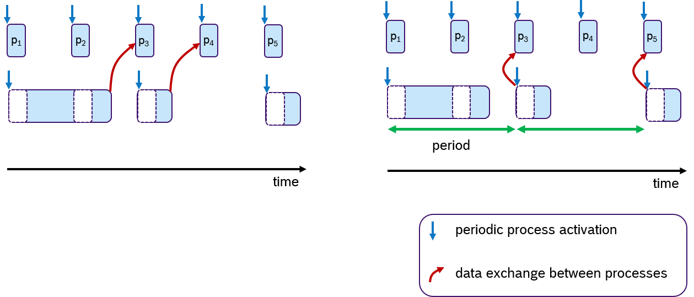
</center>
<center>
Figure 8: Data communication without and with Logical Execution Time paradigm.
</center>

An Example of the LET concept is shown in Figure 8. Assume that two processes are communicating data via one global variable. The timepoint when this data is written is at the end of the processing time. In the default case (left side), the process p<sub>3</sub> and p<sub>4</sub> receive the update. At the right side of Figure 8, the same scenario is shown with LET semantics. Here, the data is communicated only at period boundaries. In this case, the lower process communicates at the end of the period, so that always process p<sub>3</sub> and p<sub>5</sub> receive the new data.

**Concept:**
- periodic execution of processes
- assignment of fixed priorities to processes
- preemptive scheduling of processes
- co-operative scheduling of tasks within a process (sequential execution)
- data synchronization with LET-semantics


While periodic activation is possible in ROS 2 by using timers, preemptive scheduling is supported by the operating system and assigning priorities on the granularity of threads/processes that correspond to the ROS nodes; it is not possible to sequentially execute callbacks, which have no data-dependency. Furthermore data is read from the DDS queue just before the callback is executed and data is written sometime during the time the application is executed. While the `spin_period` function of the rclcpp Executor allows to check for data at a fixed period and executing those callbacks for which data is available, however, with this spin-function does not execute all callbacks irrespective wheter data is available or not. So `spin_period` is not helpful to periodically execute a number of callbacks (aka tasks within a process). So we need a mechanism that triggers the execution of multiple callbacks (aka tasks) based on a timer. Data transmission is achieved via DDS which does not allow to implement a LET-semantics. To summarize, we derive the following requirements.

**Derived requirements:**
- trigger the execution
- sequential processing of callbacks
- data synchronization with LET semantics

## rclc Executor

The rclc Executor is a ROS 2 Executor based on the rcl-layer in C programming language. As discussed above, the default rclcpp Executor is not suitable to implement real-time applications because of three main reasons: timers are preferred over all other handles, no priorization of callback execution and the round-robin to completion execution of callbacks. On the other hand, several processing patterns have been developed as best practices to achieve non-functional requirements, such as bounded end-to-end latencies, low jitter of response times of cause-effect chains, deterministic processing and short response times even in overload situations. These processing patterns are difficult to implement with the concepts availabe in the default ROS 2 Executor, therefore we have developed a flexible Executor: the rclc Executor. 

### Features

The rclc Executor is feature-complete, i.e. it supports all event types as the default ROS 2 Executor, which are:
- subscriptions
- timers
- services
- clients
- guard conditions
- actions
- lifecycle

The flexible rclc Executor provides on top the following new features:
- triggered execution
- user-defined sequential execution
- multi-threading and scheduling configuration (WIP)
- LET-semantics for data synchronization of periodic process scheduling

First, a *trigger condition* allows to define when the processing of a callback shall start. This is useful to implement sense-plan-act control loops or more complex processing structures with directed acyclic graphs. Second, a user can specify the *processing order* in which these callbacks will be executed. With this feature, the pattern of sensor fusion with multiple rates, in which data is requested from a sensor based on the arrival of some other sensor, can be easily implemented. Third, the assignment of scheduling parameters (e.g., priorities) of the underlying operating system. With this feature, prioritized processing can be implemented. Finally, for periodic applications, the *LET Semantics* has been implemented to support data consistency for periodic process scheduling. These features are now described in more detail.

#### Sequential execution

- At configuration, the user defines the order of handles.
- At configuration, the user defines whether the handle shall be called only when new data is available (ON_NEW_DATA) or whether the callback shall always be called (ALWAYS).
- At runtime, all handles are processed in the user-defined order
  - if the configuration of handle is ON_NEW_DATA, then the corresponding callback is only called if new data is available
  - if the configuration of the handle is ALWAYS, then the corresponding callback is always. If no data is available, then the callback is called with no data (e.g. NULL pointer).

Figure 9 shows three callbacks, A, B and C. Assume, they shall be executed in the order *B,A,C*. Then the user adds the callbacks to the rclc Executor in this order. Whenever new messages have arrived then the callbacks for which a new message is availabe will be always executed in the user-defined processing order. 
<center>
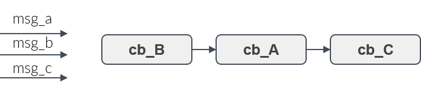
</center>
<center>
Figure 9: Sequential execution semantics.
</center>

#### Trigger condition

- Given a set of handles, a trigger condition, which is based on the availability of input data of these handles, decides when the processing of all callbacks starts. This is shown in Figure 10. 

<center>
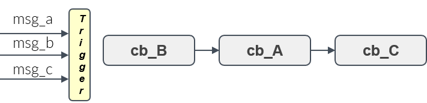
</center>
<center>
Figure 10: Executor with trigger condition
</center>

- Available options:
  - ALL operation: fires when input data is available for all handles
  - ANY operation: fires when input data is available for at least one handle (OR semantics)
  - ONE: fires when input data for a user-specified handle is available
  - User-defined function: user can implement custom logic

Figure 11 shows an example of the ALL semantics. Only if all messages *msg_A, msg_B, msg_C* were received, then trigger condition is fullfilled and the callbacks are processed in a user-defined order.
<center>
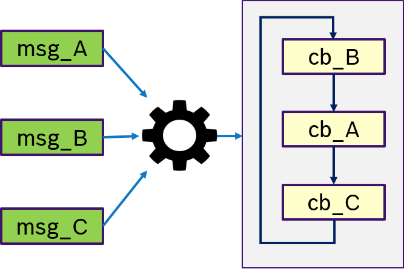
</center>
<center>
Figure 11: Trigger condition ALL
</center>

Figure 12 shows an example of the ANY semantics. Thas is, if any messages *msg_A, msg_B, msg_C* was received, then trigger condition is fullfilled and the callbacks are processed in a user-defined order. This is equivalent to OR semantics.
<center>
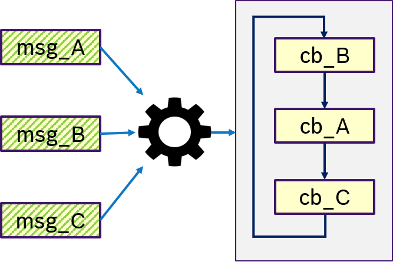
</center>
<center>
Figure 12: Trigger condition ANY (OR)
</center>

Figure 13 shows an example of the ONE semantics. Thas is, only if message *msg_B* was received, the trigger condition is fullfilled and (potentially all) callbacks are processed in a user-defined order.
<center>
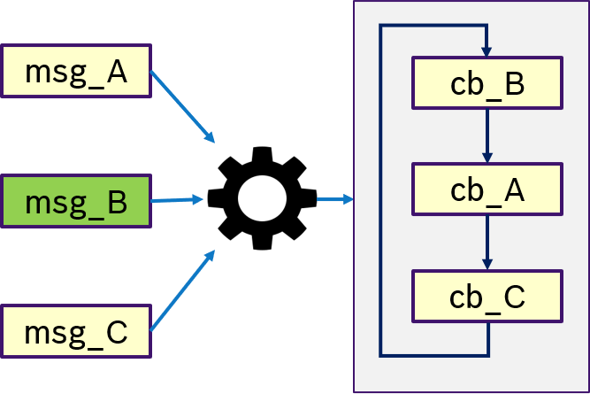
</center>
<center>
Figure 13: Trigger condition ONE
</center>

Figure 14 describes the custom semantics. A custom trigger condition with could be a more complex logic of multiple messages, can be passed to the executor. This might also include hardware triggers, like interrupts. 
<center>
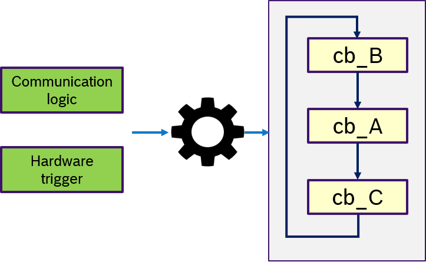
</center>
<center>
Figure 14: Trigger condition user-defined
</center>

#### LET-Semantics
- Assumption: time-triggered system, the executor is activated periodically
- When the trigger fires, reads all input data and makes a local copy
- Processes all callbacks in sequential order
- Write output data at the end of the executor's period (Note: this is not implemented yet)

Additionally we have implemented the current rclcpp Executor semantics ("RCLCPP"):
- waiting for new data for all handles (rcl_wait)
- using trigger condition ANY
- if trigger fires, start processing handles in pre-defined sequential order
- request from DDS-queue the new data just before the handle is executed (rcl_take)

The selection of the Executor semantics is optional. The default semantics is "RCLCPP".

#### Multi-threading and scheduling configuration

The rclc Executor has been extended for multi-threading. It supports the assignment of scheduling policies, like priorities or more advanced scheduling algorithms as reservation-based scheduling, to subscription callbacks. [[Pull Request](https://github.com/ros2/rclc/pull/87), Pre-print [SLD2021](#SLD2021)]. The overall architecture is shown in Figure 15. One Executor thread is responsible for checking for new data from the DDS queue. For every callback, a thread is spawned with the dedicted scheduling policy provided by the operating system. The Executor then dispatches new data of a subscription to it's corresponding callback function, which is then executed in its own thread by operating system.

<center>
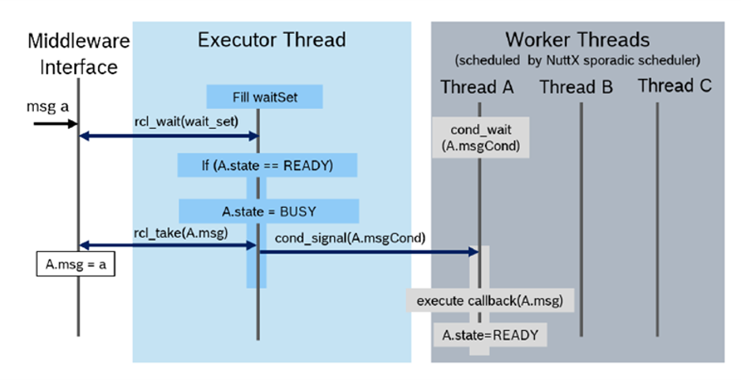
</center>
<center>
Figure 15: multi-threaded rclc-Executor
</center>

### Executor API
The API of the rclc Executor can be divided in two phases: Configuration and Running.
#### Configuration phase
During the configuration phase, the user shall define:
- the total number of callbacks
- the sequence of the callbacks
- trigger condition (optional, default: ANY)
- data communcation semantics (optional, default ROS2)

As the Executor is intended for embedded controllers, dynamic memory management is crucial. Therefore at initialization of the rclc Executor, the user defines the total number of callbacks. The necessary dynamic memory will be allocated only in this phase and no more memory in the running phase. This makes this Executor static in the sense, that during runtime no additional callbacks can be added. 

Also in the XRCE-DDS middleware the maximum number of handles need to be configured. See [Memory Management Tutorial](https://docs.vulcanexus.org/en/humble/rst/tutorials/micro/memory_management/memory_management.html#entity-creation) for the defaults and configuration of the colcon.meta configuration file. To make sure that the changes were applied, you can check the defined values in the following library include file: build/rmw_microxrcedds/include/rmw_microxrcedds_c/config.h.

Then, the user adds handles and the corresponding callbacks (e.g. for subscriptions and timers) to the Executor. The order in which this takes place, defines later the sequential processing order during runtime.

For each handle the user can specify, if the callback shall be executed only if new data is available (ON_NEW_DATA) or if the callback shall always be executed (ALWAYS). The second option is useful when the callback is expected to be called at a fixed rate.

The trigger condition defines when the processing of these callbacks shall start. For convenience some default conditions have been defined:
- trigger_any(default) : start executing if any callback has new data
- trigger_all : start executing if all callbacks have new data
- trigger_one(&`data`) : start executing if `data` has been received
- user_defined_function: the user can also define its own function with more complex logic

With 'trigger_any' being the default, the current semantics of the rclcpp Executor is selected.

The data communication semantics can be
- ROS2 (default)
- LET

To be compatible with ROS2 rclcpp Executor, the existing rclcpp semantics is implemented as 'ROS2'. That is, with the spin-function the DDS-queue is constantly monitored for new data (rcl_wait). If new data becomes available, then is fetched from DDS (rcl_take) immediately before the callback is executed. All callbacks are processed in the user-defined order, this is the only difference to the rclcpp Executor, in which no order can be specified.

Secondly, the LET semantics is implemented such that at the beginning of processing all available data is fetched (rcl_take) and buffered and then the callbacks are processed in the pre-defined operating on the buffered copy.

#### Running phase

As the main functionality, the Executor has a `spin`-function which constantly checks for new data at the DDS-queue, like the rclcpp Executor in ROS2. If the trigger condition is satisfied then all available data from the DDS queue is processed according to the specified semantics (ROS or LET) in the user-defined sequential order. After all callbacks have been processed the DDS is checked for new data again.

Available spin functions are
- `spin_some`  - spin one time
- `spin_period` - spin with a period
- `spin` - spin indefinitly

### Examples
We provide the relevant code snippets how to setup the rclc Executor for the processing patterns as described above.

#### Sense-plan-act pipeline in robotics example

In this example we want to realise a sense-plan-act pipeline in a single thread. The trigger condition is demonstrated by activating
the sense-phase when both data for the Laser and IMU are available. Three executors are necessary `exe_sense`, `exe_plan` and `exe_act`. The two sensor acquisition callbacks `sense_Laser` and `sense_IMU` are registered in the Executor `exe_sense`.
The trigger condition ALL is responsible to activate the sense-phase only when all data for these two callbacks are available. Finally all three Executors are spinning using a `while`-loop and the `spin_some` function.

The definitions of callbacks are omitted.

```C
...
rcl_subscription_t sense_Laser, sense_IMU, plan, act;
rcle_let_executor_t exe_sense, exe_plan, exe_act;
// initialize executors
rclc_executor_init(&exe_sense, &context, 2, ...);
rclc_executor_init(&exe_plan, &context, 1, ...);
rclc_executor_init(&exe_act, &context, 1, ...);
// executor for sense-phase
rclc_executor_add_subscription(&exe_sense, &sense_Laser, &my_sub_cb1, ON_NEW_DATA);
rclc_executor_add_subscription(&exe_sense, &sense_IMU, &my_sub_cb2, ON_NEW_DATA);
rclc_let_executor_set_trigger(&exe_sense, rclc_executor_trigger_all, NULL);
// executor for plan-phase
rclc_executor_add_subscription(&exe_plan, &plan, &my_sub_cb3, ON_NEW_DATA);
// executor for act-phase
rclc_executor_add_subscription(&exe_act, &act, &my_sub_cb4, ON_NEW_DATA);

// spin all executors
while (true) {
  rclc_executor_spin_some(&exe_sense);
  rclc_executor_spin_some(&exe_plan);
  rclc_executor_spin_some(&exe_act);
}
```

#### Synchronization of multiple rates example

The sensor fusion synchronizing the multiple rates with a trigger is shown below.

```C
...
rcl_subscription_t aggr_IMU, sense_Laser, sense_IMU;
rcle_let_executor_t exe_aggr, exe_sense;
// initialize executors
rclc_executor_init(&exe_aggr, &context, 1, ...);
rclc_executor_init(&exe_sense, &context, 2, ...);
// executor for aggregate IMU data
rclc_executor_add_subscription(&exe_aggr, &aggr_IMU, &my_sub_cb1, ON_NEW_DATA);
// executor for sense-phase
rclc_executor_add_subscription(&exe_sense, &sense_Laser, &my_sub_cb2, ON_NEW_DATA);
rclc_executor_add_subscription(&exe_sense, &sense_IMU, &my_sub_cb3, ON_NEW_DATA);
rclc_executor_set_trigger(&exe_sense, rclc_executor_trigger_all, NULL);

// spin all executors
while (true) {
  rclc_executor_spin_some(&exe_aggr);
  rclc_executor_spin_some(&exe_sense);
}
```

The setup for the sensor fusion using sequential execution is shown below.
Note that the sequetial order is `sense_IMU`, which will request the aggregated IMU message, and then `sense_Laser`
while the trigger will fire, when a laser message is received.

```C
...
rcl_subscription_t sense_Laser, sense_IMU;
rcle_let_executor_t exe_sense;
// initialize executor
rclc_executor_init(&exe_sense, &context, 2, ...);
// executor for sense-phase
rclc_executor_add_subscription(&exe_sense, &sense_IMU, &my_sub_cb1, ALWAYS);
rclc_executor_add_subscription(&exe_sense, &sense_Laser, &my_sub_cb2, ON_NEW_DATA);
rclc_executor_set_trigger(&exe_sense, rclc_executor_trigger_one, &sense_Laser);
// spin
rclc_executor_spin(&exe_sense);
```
#### High priority processing path example

This example shows the sequential processing order to execute the obstacle avoidance `obst_avoid`
after the callbacks of the sense-phase and before the callback of the planning phase `plan`.
The control loop is started when a laser message is received. Then an aggregated IMU message is requested,
like in the example above. Then all the other callbacks are always executed. This assumes that these callbacks
communicate via a global data structure. Race conditions cannot occur, because the callbacks
run all in one thread.

```C
...
rcl_subscription_t sense_Laser, sense_IMU, plan, act, obst_avoid;
rcle_let_executor_t exe;
// initialize executors
rclc_executor_init(&exe, &context, 5, ...);
// define processing order
rclc_executor_add_subscription(&exe, &sense_IMU, &my_sub_cb1, ALWAYS);
rclc_executor_add_subscription(&exe, &sense_Laser, &my_sub_cb2, ON_NEW_DATA);
rclc_executor_add_subscription(&exe, &obst_avoid, &my_sub_cb3, ALWAYS);
rclc_executor_add_subscription(&exe, &plan, &my_sub_cb4, ALWAYS);
rclc_executor_add_subscription(&exe, &act, &my_sub_cb5, ALWAYS);
rclc_executor_set_trigger(&exe, rclc_executor_trigger_one, &sense_Laser);
// spin
rclc_executor_spin(&exe);
```

#### Real-time embedded applications example

With seqential execution the co-operative scheduling of tasks within a process can be modeled. The trigger condition is used to periodically activate the process which will then execute all callbacks in a pre-defined order. Data will be communicated using the LET-semantics. Every Executor is executed in its own tread, to which an appropriate priority can be assigned.

In the following example, the Executor is setup with 4 handles. We assume a process has three subscriptions `sub1`, `sub2`, `sub3`. The sequential processing order is given by the order as they are added to the Executor. A timer `timer` defines the period.  The `trigger_one` with the paramter `timer` is used, so that whenever the timer is ready, all callbacks are processed. Finally the data communication semantics LET is defined.
```C
#include "rcl_executor/let_executor.h"

// define subscription callback
void my_sub_cb1(const void * msgin)
{
  // ...
}
// define subscription callback
void my_sub_cb2(const void * msgin)
{
  // ...
}
// define subscription callback
void my_sub_cb3(const void * msgin)
{
  // ...
}

// define timer callback
void my_timer_cb(rcl_timer_t * timer, int64_t last_call_time)
{
  // ...
}

// necessary ROS 2 objects
rcl_context_t context;   
rcl_node_t node;
rcl_subscription_t sub1, sub2, sub3;
rcl_timer_t timer;
rcle_let_executor_t exe;

// define ROS context
context = rcl_get_zero_initialized_context();
// initialize ROS node
rcl_node_init(&node, &context,...);
// create subscriptions
rcl_subscription_init(&sub1, &node, ...);
rcl_subscription_init(&sub2, &node, ...);
rcl_subscription_init(&sub3, &node, ...);
// create a timer
rcl_timer_init(&timer, &my_timer_cb, ... );
// initialize executor with four handles
rclc_executor_init(&exe, &context, 4, ...);
// define static execution order of handles
rclc_executor_add_subscription(&exe, &sub1, &my_sub_cb1, ALWAYS);
rclc_executor_add_subscription(&exe, &sub2, &my_sub_cb2, ALWAYS);
rclc_executor_add_subscription(&exe, &sub3, &my_sub_cb3, ALWAYS);
rclc_executor_add_timer(&exe, &timer);
// trigger when handle 'timer' is ready
rclc_executor_set_trigger(&exe, rclc_executor_trigger_one, &timer);
// select LET-semantics
rclc_executor_data_comm_semantics(&exe, LET);
// spin forever
rclc_executor_spin(&exe);
```

#### ROS 2 Executor Workshop Reference System
The rclc Executor has been presented at the workshop 'ROS 2 Executor: How to make it efficient, real-time and deterministic?' at [ROS World 2021](https://roscon.ros.org/world/2021/) (i.e. the online version of ROSCon)[[S2021](#S2021)]. A [Reference System](https://github.com/ros-realtime/reference-system) for testing and benchmarking ROS Executors has been developed for this workshop. The application of the rclc Executor on the reference system with the trigger condition can be found in the [rclc-executor branch of the Reference System](https://github.com/ros-realtime/reference-system/tree/rclc_executor). 

<iframe width="560" height="315" src="https://www.youtube.com/embed/IazrPF3RN1U" title="YouTube video player" frameborder="0" allow="accelerometer; autoplay; clipboard-write; encrypted-media; gyroscope; picture-in-picture" allowfullscreen></iframe>

The slides can be downloaded [here](https://ec2a4d36-bac8-4759-b25e-bb1f794177f4.filesusr.com/ugd/984e93_749e27b917a54b45b9ccb5be930841b8.pdf). All information and the videos and slides of the other talks of the workshop can be found at [www.apex.ai/roscon-21](https://www.apex.ai/roscon-21).

### Future work

- Full LET semantics (writing data at the end of the period)
  - one publisher that periodically publishes
  - if Executors are running in multiple threads,
    publishing needs to be atomic
- Multi-threaded executor with assignment of scheduling policies of unerlying operating system. [[Pull Request](https://github.com/ros2/rclc/pull/87), pre-print [SLD2021](#SLD2021)].

### Download
The rclc Executor can be downloaded from the [ros2/rclc repository](https://github.com/ros2/rclc). It is available for the ROS 2 versions Foxy, Galactic and Rolling. The repository provides several packages including the [rclc Executor](https://github.com/ros2/rclc/tree/master/rclc) and an [rclc_examples package](https://github.com/ros2/rclc/tree/master/rclc_examples) with several application examples.

## Callback-group-level Executor

The Callback-group-level Executor was an early prototype for a refined rclcpp Executor API developed in micro-ROS. It has been derived from the default rclcpp Executor and addresses some of the aforementioned deficits. Most important, it was used to validate that the underlying layers (rcl, rmw, rmw_adapter, DDS) allow for multiple Executor instances without any negative interferences.

As the default rclcpp Executor works at a node-level granularity – which is a limitation given that a node may issue different callbacks needing different real-time guarantees - we decided to refine the API for more fine-grained control over the scheduling of callbacks on the granularity of callback groups using. We leverage the callback-group concept existing in rclcpp by introducing real-time profiles such as RT-CRITICAL and BEST-EFFORT in the callback-group API (i.e. rclcpp/callback_group.hpp). Each callback needing specific real-time guarantees, when created, may therefore be associated with a dedicated callback group. With this in place, we enhanced the Executor and depending classes (e.g., for memory allocation) to operate at a finer callback-group granularity. This allows a single node to have callbacks with different real-time profiles assigned to different Executor instances - within one process.

Thus, an Executor instance can be dedicated to specific callback group(s) and the Executor’s thread(s) can be prioritized according to the real-time requirements of these groups. For example, all time-critical callbacks are handled by an "RT-CRITICAL" Executor instance running at the highest scheduler priority.

The following Figure illustrates this approach with two nodes served by three Callback-group-level Executors in one process:

<center>
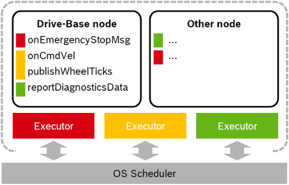
</center>

The different callbacks of the Drive-Base node are distributed to different Executors (visualized by the color red, yellow and green).  For example the onCmdVel and publishWheelTicks callback are scheduled by the same Executor (yellow). Callbacks from different nodes can be serviced by the same Executor.

### API Changes

In this section, we describe the necessary changes to the Executor API:
*   [include/rclcpp/callback\_group.hpp](https://github.com/ros2/rclcpp/blob/master/rclcpp/include/rclcpp/callback_group.hpp):

    * Introduced an enum to distinguish up to three real-time classes (requirements) per node (RealTimeCritical, SoftRealTime, BestEffort)
    * Changed association with Executor instance from nodes to callback groups.
*   [include/rclcpp/executor.hpp](https://github.com/ros2/rclcpp/blob/master/rclcpp/include/rclcpp/executor.hpp)

    * Added functions to add and remove individual callback groups in addition to whole nodes.

    * Replaced private vector of nodes with a map from callback groups to nodes.

*   [include/rclcpp/memory\_strategy.hpp](https://github.com/ros2/rclcpp/blob/master/rclcpp/include/rclcpp/memory_strategy.hpp)

    * Changed all functions that expect a vector of nodes to the just mentioned map.
*   [include/rclcpp/node.hpp](https://github.com/ros2/rclcpp/blob/master/rclcpp/include/rclcpp/node.hpp) and [include/rclcpp/node_interfaces/node_base.hpp](https://github.com/ros2/rclcpp/blob/master/rclcpp/include/rclcpp/node_interfaces/node_base.hpp)

    * Extended arguments of create\_callback\_group function for the real-time class.
    * Removed the get\_associated\_with\_executor\_atomic function.

The callback-group-level executor has been merged into ROS 2 rclcpp in [pull request 1218](https://github.com/ros2/rclcpp/pull/1218/commits).

### Test Bench

As a proof of concept, we implemented a small test bench in the present package cbg-executor_ping-pong_cpp. The test bench comprises a Ping node and a Pong node which exchange real-time and best-effort messages simultaneously with each other. Each class of messages is handled with a dedicated Executor, as illustrated in the following Figure.

<center>
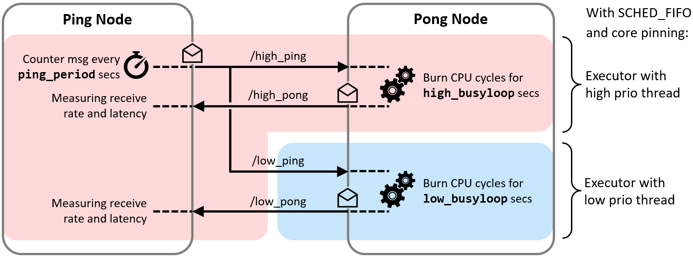
</center>

With the test bench, we validated the functioning of the approach.

<center>
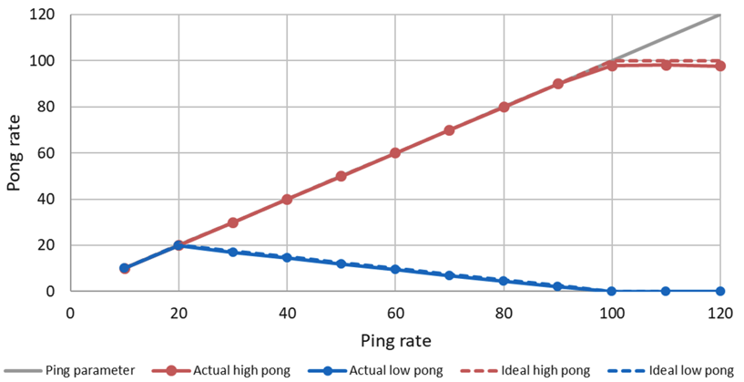
</center>

In this example, the callback for the high priority task (red line) consumes 10ms and the low priority task (blue line) 40ms in the Pong Node. With a ping rate of 20 Hz, the CPU saturates (10ms\*20+40ms\*20=1000ms). With higher frequencies the high priorty task can continue to send its pong message, while the low priority pong task degrades. With a frequency of 100Hz the high priority task requires 100% CPU utilization. With higher ping rates it keeps sending pong messages with 100Hz, while the low priority task does not get any CPU ressources any more and cannot send any messages.

The test bench is provided in the [cbg_executor_demo](https://github.com/ros2/examples/tree/master/rclcpp/executors/cbg_executor).

## Related Work

In this section, we provide an overview to related approaches and link to the corresponding APIs.

### Fawkes Framework

[Fawkes](http://www.fawkesrobotics.org/) is a robotic software framework, which supports synchronization points for sense-plan-act like execution. It has been developed by RWTH Aachen since 2006. Source code is available at [github.com/fawkesrobotics](https://github.com/fawkesrobotics).

#### Synchronization
Fawkes provides developers different synchronization points, which are very useful for defining an execution order of a typical sense-plan-act application. These ten synchronization points (wake-up hooks) are the following (cf. [libs/aspect/blocked_timing.h](https://github.com/fawkesrobotics/fawkes/blob/master/src/libs/aspect/blocked_timing.h)):

*   WAKEUP\_HOOK\_PRE\_LOOP
*   WAKEUP\_HOOK\_SENSOR\_ACQUIRE
*   WAKEUP\_HOOK\_SENSOR\_PREPARE
*   WAKEUP\_HOOK\_SENSOR\_PROCESS
*   WAKEUP\_HOOK\_WORLDSTATE
*   WAKEUP\_HOOK\_THINK
*   WAKEUP\_HOOK\_SKILL   
*   WAKEUP\_HOOK\_ACT     
*   WAKEUP\_HOOK\_ACT\_EXEC
*   WAKEUP\_HOOK\_POST\_LOOP  

#### Configuration at compile time
At compile time, a desired synchronization point is defined as a constructor parameter for a module. For example, assuming that `mapLaserGenThread` shall be executed in SENSOR_ACQUIRE, the constructor is implemented as:

```C++
MapLaserGenThread::MapLaserGenThread()
  :: Thread("MapLaserGenThread", Thread::OPMODE_WAITFORWAKEUP),
     BlockedTimingAspect(BlockedTimingAspect::WAKEUP_HOOK_SENSOR_ACQUIRE),
     TransformAspect(TransformAspect::BOTH_DEFER_PUBLISHER, "Map Laser Odometry")
```

Similarly, if `NaoQiButtonThread` shall be executed in the SENSOR_PROCESS hook, the constructor is:

```C++
NaoQiButtonThread::NaoQiButtonThread()
  :: Thread("NaoQiButtonThread", Thread::OPMODE_WAITFORWAKEUP),
     BlockedTimingAspect(BlockedTimingAspect::WAKEUP_HOOK_SENSOR_PROCESS)
```

#### Runtime execution
At runtime, the *Executor* iterates through the list of synchronization points and executes all registered threads until completion. Then, the threads of the next synchronization point are called.

A module (thread) can be configured independent of these sense-plan-act synchronization points. This has the effect, that this thread is executed in parallel to this chain.

The high level overview of the Fawkes framework is shown in the next figure. At compile-time the configuration of the sense-plan act wakeup hook is done (upper part), while at run-time the scheduler iterates through this list of wakeup-hooks (lower part):

<center>
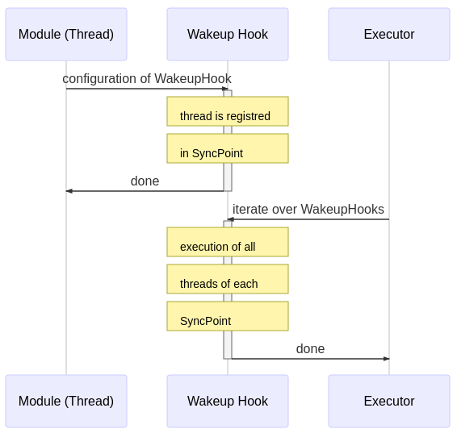
</center>

Hence, at run-time, the hooks are executed as a fixed static schedule without preemption. Multiple threads registered in the same hook are executed in parallel.

Orthogonal to the sequential execution of sense-plan-act like applications, it is possible to define further constraints on the execution order by means of a `Barrier`. A barrier defines a number of threads, which need to have finished before the thread can start, which owns the barrier.

These concepts are implemented by the following main classes:

* *Wakeup hook* by `SyncPoint` and `SyncPointManager`, which manages a list of synchronization points.
* *Executor* by the class `FawkesMainThread`, which is the scheduler, responsible for calling the user threads.
* `ThreadManager`, which is derived from `BlockedTimingExecutor`, provides the necessary API to add and remove threads to wakeup hooks as well as for sequential execution of the wakeup-hooks.
* `Barrier` is an object similar to `condition_variable` in C++.

#### Discussion

All threads are executed with the same priority. If multiple sense-plan-act chains shall be executed with different priorities, e.g. to prefer execution of emergency-stop over normal operation, then this framework reaches its limits.

Also, different execution frequencies cannot be modeled by a single instance of this sense-plan-act chain. However, in robotics the fastest sensor will drive the chain and all other hooks are executed with the same frequency.

The option to execute threads independent of the predefined wakeup-hooks is very useful, e.g. for diagnostics. The concept of the Barrier is useful for satisfying functional dependencies which need to be considered in the execution order.

## References
* [S2021]<a name="S2021"></a> J. Staschulat, "Micro-ROS: The rclc Executor", in Workshop ROS 2 Executor: How to make it efficient, real-time and deterministic? at ROS World, Oct. 2021, [[slides](https://ec2a4d36-bac8-4759-b25e-bb1f794177f4.filesusr.com/ugd/984e93_749e27b917a54b45b9ccb5be930841b8.pdf)] [[Video](https://www.youtube.com/embed/IazrPF3RN1U)]

* [SLD2021]<a name="SLD2021"></a> J. Staschulat, R. Lange and D. N. Dasari, "Budget-based real-time Executor for Micro-ROS", arXiv Pre-Print, May 2021. [[paper](https://arxiv.org/abs/2105.05590)] 

* [L2020]<a name="L2020"></a> Ralph Lange: Advanced Execution Management with ROS 2, ROS-Industrial Conference, Dec 2020 [[Slides]](https://micro-ros.github.io/download/2020-12-16_Advanced_Execution_Management_with_ROS_2.pdf)

* [SLL2020]<a name="SLL2020"></a> J. Staschulat, I. Lütkebohle and R. Lange, "The rclc Executor: Domain-specific deterministic scheduling mechanisms for ROS applications on microcontrollers: work-in-progress," 2020 International Conference on Embedded Software (EMSOFT), Singapore, Singapore, 2020, pp. 18-19. [[Paper]](https://ieeexplore.ieee.org/document/9244014) [[Video]](https://whova.com/embedded/session/eswe_202009/1145800/)

* [CB2019]<a name="CB2019"> </a> D. Casini, T. Blaß, I. Lütkebohle, B. Brandenburg: Response-Time Analysis of ROS 2 Processing Chains under Reservation-Based Scheduling, in Euromicro-Conference on Real-Time Systems 2019. [[Paper]](http://drops.dagstuhl.de/opus/volltexte/2019/10743/) [[slides]](https://t-blass.de/talks/ECRTS2019.pdf)

* [L2018]<a name="L2018"></a> Ralph Lange: Callback-group-level Executor for ROS 2. Lightning talk at ROSCon 2018. Madrid, Spain. Sep 2018. [[Slides]](https://roscon.ros.org/2018/presentations/ROSCon2018_Lightning1_4.pdf) [[Video]](https://vimeo.com/292707644)

* [EK2018]<a name="EK2018"></a> R. Ernst, S. Kuntz, S. Quinton, M. Simons: The Logical Execution Time Paradigm: New Perspectives for Multicore Systems, February 25-28 2018 (Dagstuhl Seminar 18092). [[Paper]](http://drops.dagstuhl.de/opus/volltexte/2018/9293/pdf/dagrep_v008_i002_p122_18092.pdf)

* [NSP2018]<a name="NSP2018"></a> A. Naderlinger, S. Resmerita, and W. Pree: LET for Legacy and Model-based Applications,
Proceedings of The Logical Execution Time Paradigm: New Perspectives for Multicore Systems (Dagstuhl Seminar 18092), Wadern, Germany, February 2018.

* [BP2017]<a name="BP2017"></a> A. Biondi, P. Pazzaglia, A. Balsini,  M. D. Natale: Logical Execution Time Implementation and Memory Optimization Issues in AUTOSAR Applications for Multicores, International Worshop on Analysis Tools and Methodologies for Embedded and Real-Time Systems (WATERS2017), Dubrovnik, Croatia.[[Paper]](https://pdfs.semanticscholar.org/4a9e/b9a616c25fd0b4a4f7810924e73eee0e7515.pdf)

* [KZH2015]<a name="KZH2015"></a> S. Kramer, D. Ziegenbein, and A. Hamann: Real World Automotive Benchmarks For Free, International Workshop on Analysis Tools and Methodologies for Embedded adn Real-Time Sysems (WATERS), 2015.

* [HHK2001]<a name="HHK2001"></a> Henzinger T.A., Horowitz B., Kirsch C.M. (2001) Giotto: A Time-Triggered Language for Embedded Programming. In: Henzinger T.A., Kirsch C.M. (eds) Embedded Software. EMSOFT 2001. Lecture Notes in Computer Science, vol 2211. Springer, Berlin, Heidelberg

* [LL1973]<a name="LL1973"></a> Liu, C. L.; Layland, J.:Scheduling algorithms for multiprogramming in a hard real-time environment, Journal of the ACM, 20 (1): 46–61, 1973.